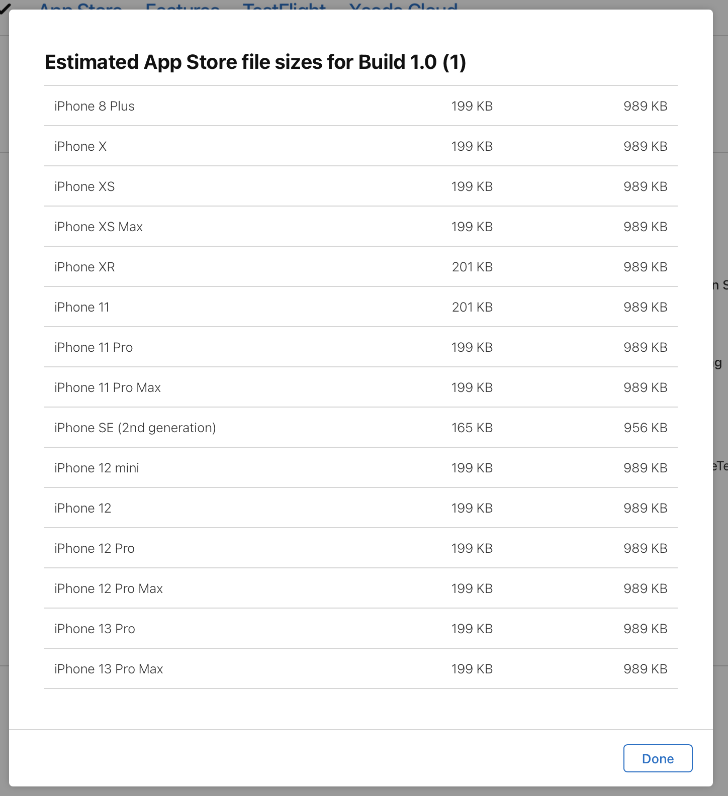
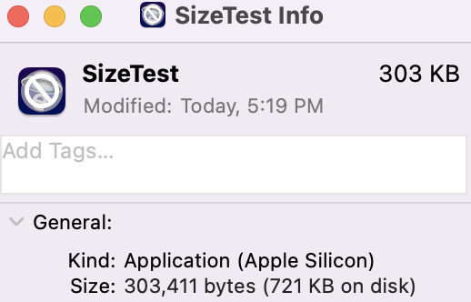

# App Store Size Example

This example app demonstrates the issues with using Apple provided tooling for measuring app size. Three sources are used to measure install size of an iOS app, and all report different values. This problem becomes more evident with more files in your app. In this example, we include 100 small xml files.

## Sample App

The sample app is in `SizeTest`. It's the default new iOS app created by Xcode 13, with 100 xml files add to the app bundle and app icon files added.

## XCArchive

The archive used to upload to app store connect is included as `SizeTest 10-2-21, 5.17 PM.xcarchive`

## App Thinning Size Report

The app thinning size report generated from the archive is included as `SizeTest 2021-10-02 17-19-54/App Thinning Size Report.txt`. All artifacts generated are also included, and the .ipa used for the iPhone 13 Pro is extracted to a .app so its size could be measured with finder.

## Results

App Store Connect reports on the size of uploaded apps, here's the sizes we get for this sample app:

Finder also reports the "size on disk" of the `.app`:

The app thinning size reports the install size for iPhone 13 Pro to be 303 KB. This is exactly the size given in finder, but not the "size on disk". So you can see that the app thinning size report ignores effect such as the file system minimum allocation unit. App Store Connect reports a size of 989 KB, **~37% larger than the 721 KB size on disk from finder**. This is the discrepancy between what you can measure with Apple tooling locally and what you see on the App Store.

Historically, a major difference in size between local measurements and the app store came from the App Store encryption added to an app binary. However, this affected download size because the encrypted app binary did not compress as well, but it does not explain the install size difference.

[Emerge](https://emergetools.com) can help you get measurements that more closely match what you will see on the App Store.